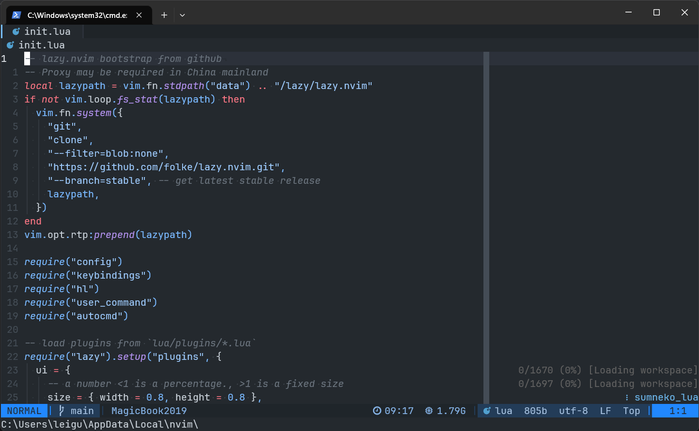

# My NeoVim Configuration

> NOTE: Experimental configuration, do not use.

## Features

- 📦 uses [Lazy.nvim](https://github.com/folke/lazy.nvim) as package manager.
- Supported languages: Python, Rust, Lua, Markdown

## Installation

To deploy this configuration on Windows, you need to prepare some environments and executables:

- `7z`/`unzip`
- Node.js & npm
- Python3.10+ & pip
- `wget` & `curl`
- Compiler for tree-sitter: `C++ Build Tools` in Visual Studio for Windows, `gcc` for Linux and Darwin.
- Git

Then clone this repo to the path of config:

```bash
git clone https://github.com/Erven2016/nvim.git <path>

# <path>
# Windows: ~\AppData\Local\nvim
# Linux/Darwin: ~/.config/nvim
```

After cloned successfully, then run `nvim` in your terminal, nvim will install lazy.nvim and other plugins via git. **Proxy is required in China mainland.**

To do

## Basic keybindings

Most of [the default keys](https://neovim.io/doc/user/quickref.html) of `neovim` is unchanged.

Note: `leader` key is `,` key;
Modes: n: `Normal`; t: `Terminal`; o: `block`; v: `visual`; x: `visual_block`; c: `command`; i: `insert`;

File:

- n. `ff`: file finder
- n. `fz`: fuzzy find buffer content
- n. `fm`: file manager

Buffer:

- n. `Alt`-`,`: switch to previous buffer
- n. `Alt`-`.`: switch to next buffer
- n. `Alt`-`<`: move buffer to previous position of tabline
- n. `Alt`-`<`: move buffer to next position of tabline
- n. `Alt`-{`1`~`9`}: switch to buffer `N`
- n. `Alt`-`0`: switch to the last buffer
- n. `Alt`-`pin`: pin/unpin a buffer
- n. `Alt`-`C`: close current buffer
- n. `Alt`-`:`: close buffers in the left of current buffer
- n. `Alt`-`"`: close buffers in the right of current buffer
- n. `leader`+`b`+`m`: show buffer list
- n. `leader`+`b`+`o`: close other buffers
- n. `Ctrl`-`p`: magic buffer-picking mode
- n. `Space`+`b`+{`b`,`d`,`l`,`w`}: sorting buffers by {b:buffer number; d:directory; l:language; w:windows number}

Session:

- n. `leader`+`s`+`w`: create a session for current workspace
- n. `leader`+`s`+`l`: load a session from existed sessions
- n. `leader`+`s`+`d`: delete a session from existed sessions

Code actions:

- n. `Tab`: code action menu in current line
- n. `F2`: rename variable/function
- n. `Alt`-`F2`: rename variable/function for selected files
- n. `Alt`-`F`/`c`+`=`: format code

Diagnostic:

- n. `[`+`e`: jump to previous diagnostic
- n. `]`+`e`: jump to next diagnostic
- n. `Alt`-`d`: show diagnostic of current line
- n. `Alt`-`c`: show diagnostic of cursor
- n. `Alt`-`x`: show diagnostic of current buffer
- n. `Alt`-`X`: show diagnostic of all buffers

Code document and reference:

- n. `K`: show hover document
- n. `Alt`-`K`: show peek definition
- n. `Alt`-`F`: open LSP finder
- n. `Alt`-`o`: toggle code outline
- n. `g`+`d`: go to code defined location

Git:

- n. `g`+`s` : git status
- n. `g`+`S` : git stash
- n. `g`+`b` : git branches
- n. `[`+`h` : previous hunk [all default keymaps from gitsigns](https://github.com/lewis6991/gitsigns.nvim#keymaps)
- n. `]`+`h` : next hunk
- n. `leader`+`h`+`s`: stage hunk
- n. `leader`+`h`+`S`: stage buffer
- n. `leader`+`h`+`r`: reset hunk
- n. `leader`+`h`+`R`: reset buffer
- n. `leader`+`h`+`u`: undo stage hunk
- n. `leader`+`h`+`d`: diff this
- n. `leader`+`h`+`D`: diff this ~
- n. `leader`+`h`+`b`: toggle full line blame
- n. `leader`+`t`+`b`: toggle current line blame
- n. `leader`+`t`+`d`: toggle deleted
- ox. `i`+`h`: select hunk
- n. `g`+`l`: open lazygit in terminal (if lazygit is installed)

Terminal:
[Keymaps in `floaterm` buffer](#Floaterm)

- t. `Alt`-```: likes `ESC` key, quitting Terminal mode
- n. `Ctrl`-`\`: toggle float terminal

## Keymaps in plugins

### Floaterm

- n. `n`: create a new terminal

## To-do List

- [ ] improve keymaps for `Lspsaga`
- [ ] adding more doc details in `README.md`
- [ ] using `FloatermSend` to run current line in terminal
